# Intelligent VR Store Assistant for Oculus Rift

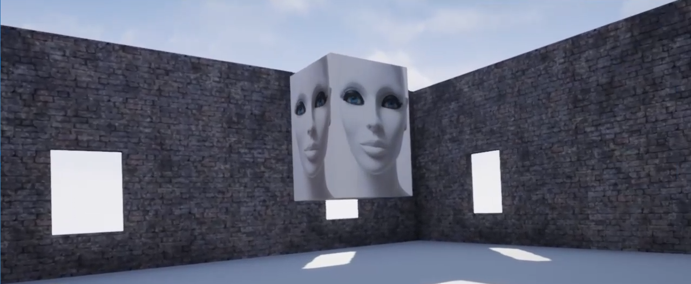

Recently I joined the VR program of the Intel Software Innovators program, after being involved in the IoT and AI programs for around a year. This project documents my first ever VR project. 

Intelligent VR Store Assistant for Oculus Rift takes you from a blank Unreal Engine 4 Oculus project to a functioning Artificially Intelligent VR store assistant. The project includes voice synthesis, voice recognition, natural language understanding and the Internet of Things.

## Software Requirements

- [Unreal Engine](https://www.unrealengine.com/en-US/what-is-unreal-engine-4 "Unreal Engine") in this example 4.19.2 was used.
- [Visual Studio 2015](https://visualstudio.microsoft.com/vs/older-downloads "Visual Studio 2015").

## Hardware Requirements

- 1 x VR ready machine
- 1 x [Oculus Rift](https://www.oculus.com/rift/ "Oculus Rift")

## What Will We Make?

In this tutorial you will learn how to create an Artificial Intelligence Virtual Reality store assistant that can understand your spoken requests and show you the products you want. We will use the iotJumpWay platform to communicate with possible back end applications or ordering systems. 

The project is a work in progress and will be updated regularly. Below you will find everything covered in this tutorial:

- Install Required Software
- Cloning The Repo (Optional)
- Create Unreal Engine Project
- Add Starter Content
- Add Walls
- Create An Actor
- Add Microsoft SAPI (Speech Synthesis)

## Install Required Software

Set up Unreal Engine and Visual Studio 2015, you need to install that specific version of Visual Studio. Whilst installing Visual Studio 2015 you need to ensure that you install the C++ extras also.

## Cloning The Repo (Optional)

You can optionally download the full code by cloning this repository to a location on your development terminal. This is the first time I have shared an Unreal Engine project to Github so if anything does not work please alert me via the repo Issues.

Navigate to the directory you would like to download it to and issue the following commands.

    $ git clone https://github.com/iotJumpway/Oculus-Examples.git

Once you have the repo, you will find the project files in [Oculus-Examples/Rift/vrAIretail](https://github.com/iotJumpway/Oculus-Examples/tree/master/Rift/vrAIretail "Oculus-Examples/Rift/vrAIretail").

[](https://github.com/iotJumpway/Oculus-Examples/tree/master/Rift/vrAIretail)

## Create Unreal Engine Project

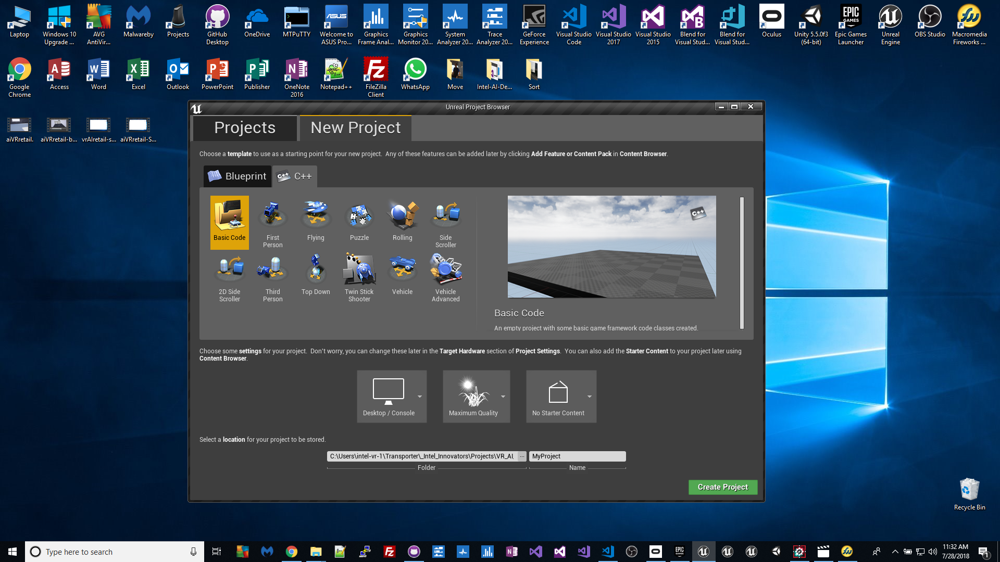

The first stage is for us to create a new Unreal Engine 4 project, as mentioned earlier I have used 4.19.2. I decided not to start the project with Starter Content, but to import the starter content after, the reason for this was at least for me when I imported it when creating the projects more maps etc were created. 

## Add Starter Content

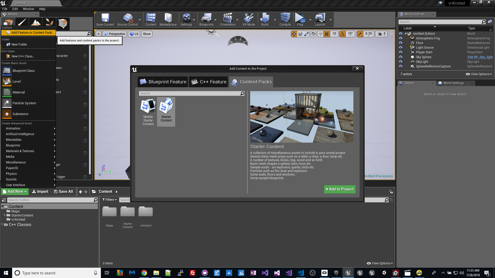

We will only use a very small amount of the Starter Content, but first we need to import it, click on the **Add New** button in the content window then select **Add Feature or Content Pack**, select **Content Packs** and **Starter Content**.

## Making a room

[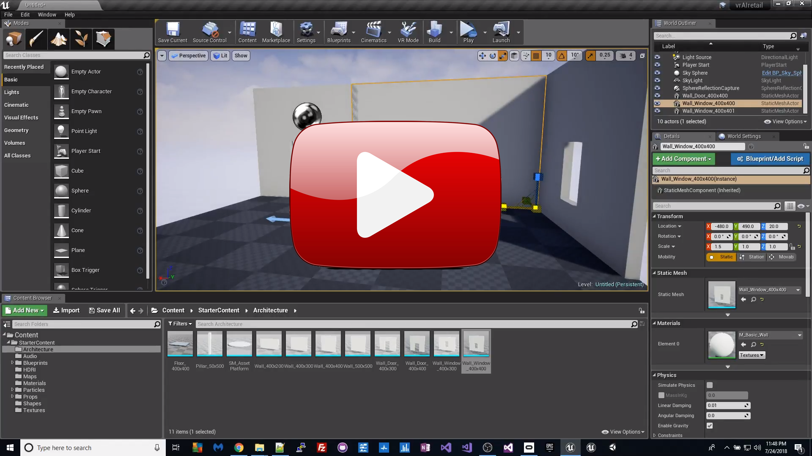](https://www.youtube.com/watch?v=JRB2fWXm-Fo)

Now we are going to make the room, you can follow the video tutorial by clicking on the image above. In the video you are shown how to use the walls from the Starter Content to create the walls for your room.

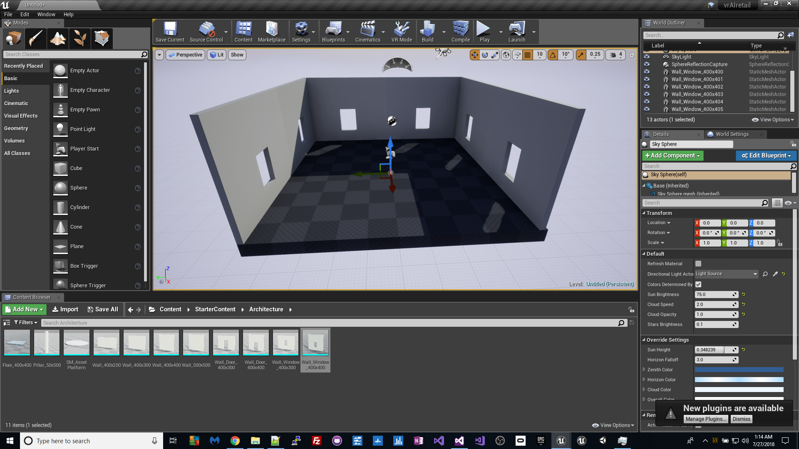

If you follow the YouTube guide above you should now have a complete room, the only thing not shown in the video is adding the floor coloring, you can do this by repeating the steps shown for the walls.

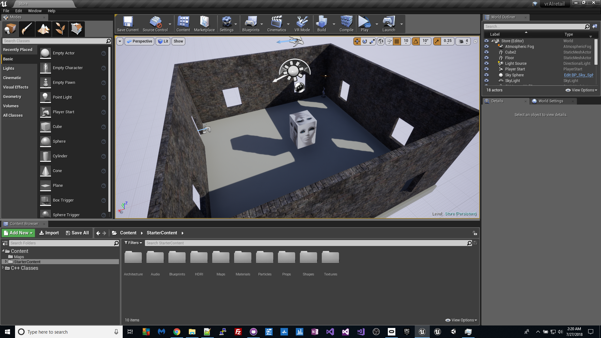

## Create An Actor

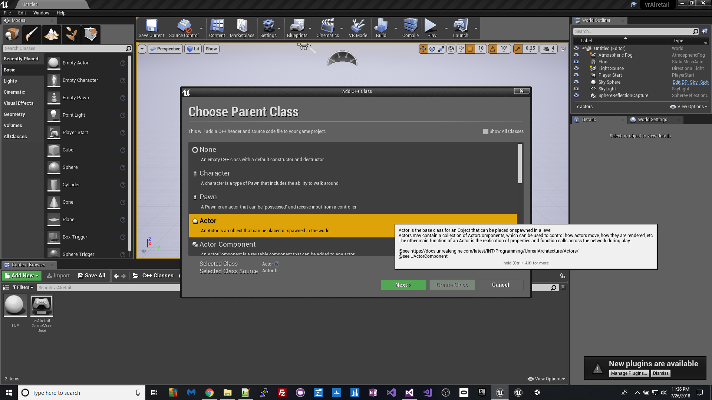

Now we need to create an actor that will become our Artificial Intelligence store assistant. Right click in the content area and select **New C++ Class**, then select **Actor** and follow the steps to setup your Actor. Once you have created your Actor, Visual Studio 2015 should open and you should be able to access the C++ source code for your project and your Actor.

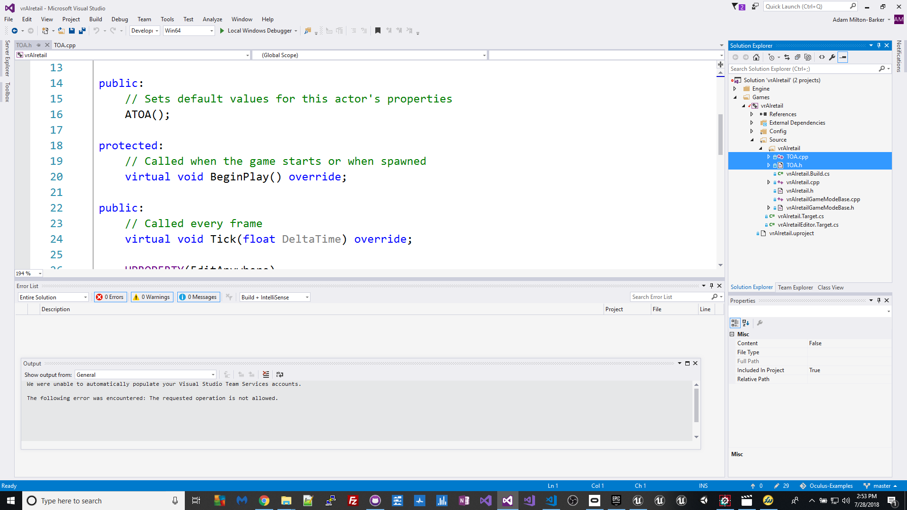

In my project I created the Actor TOA, you can find the files below:

- [TOA.h](https://github.com/iotJumpway/Oculus-Examples/blob/master/Rift/vrAIretail/Source/vrAIretail/TOA.h "TOA.h")
- [TOA.cpp](https://github.com/iotJumpway/Oculus-Examples/blob/master/Rift/vrAIretail/Source/vrAIretail/TOA.cpp "TOA.cpp")

In these files we create a spinning actor that will become our Artificially Intelligent store assistant. Add the code linked above into your own actor files, making sure to replace any project specific information with your own.

The code in the above files that is relevant to this stage of development basically does the following:

- Makes the Actor spin

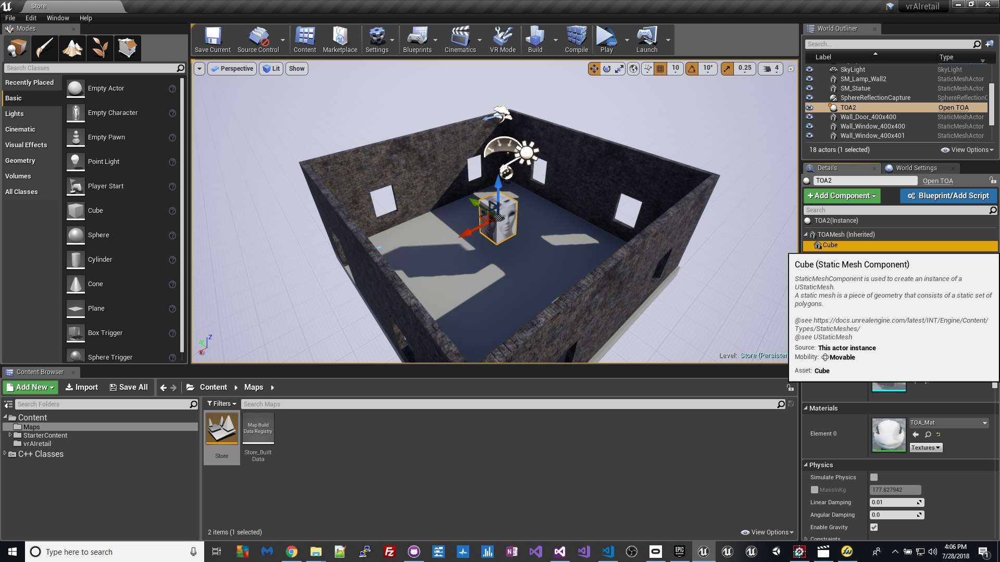

Next you want to create an Actor, go back to Unreal Engine and drag your Actor on into the scene, click on **Add Component** and select **Cube**.

## Add Microsoft SAPI (Speech Synthesis)

We want our Actor to say hello when the program first starts. For this we will use Microsoft SAPI, you may of already noticed the code for this section when you were adding **TOA.h** and **TOA.cpp** to the project.

[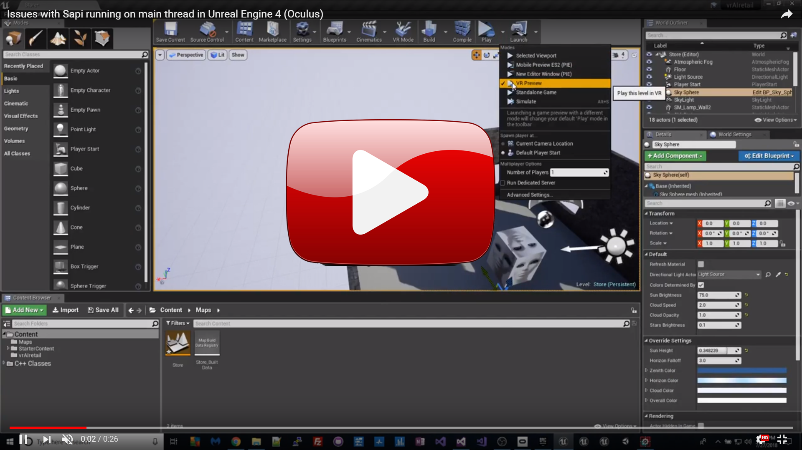](https://www.youtube.com/watch?v=tiImtJB7Py4)

At this stage it is possible to run the program on your headset. Originally I found that SAPI was blocking the main thread, meaning that you would hear the speech first and then the VR will load, additionally attempting to use SAPI once the VR has loaded results in freezing.

## Asynchronous Speech Synthesis 

To stop SAPI blocking the main thread I created a function for the SAPI code:

```
void Welcome()
{
	ISpVoice * pVoice = NULL;

	HRESULT hr = CoCreateInstance(CLSID_SpVoice, NULL, CLSCTX_ALL, IID_ISpVoice, (void **)&pVoice);
	if (SUCCEEDED(hr))
	{
		ISpObjectToken* cpToken(NULL);
		SpFindBestToken(SPCAT_VOICES, L"gender=female", L"", &cpToken);
		pVoice->SetVoice(cpToken);
		cpToken->Release();
		hr = pVoice->Speak(L"Hello, welcome to the VR AI Retail Store", 0, NULL);
	}
	pVoice->Release();
	pVoice = NULL;
}
```

And then replaced the original SAPI code with an async call to the function:

```
void ATOA::BeginPlay()
{
	Super::BeginPlay();
	FTimerHandle TOA;
	TFuture<void> A = Async<void>(EAsyncExecution::Thread, Welcome);
}
```

You can view the video by click on the video graphic below:

[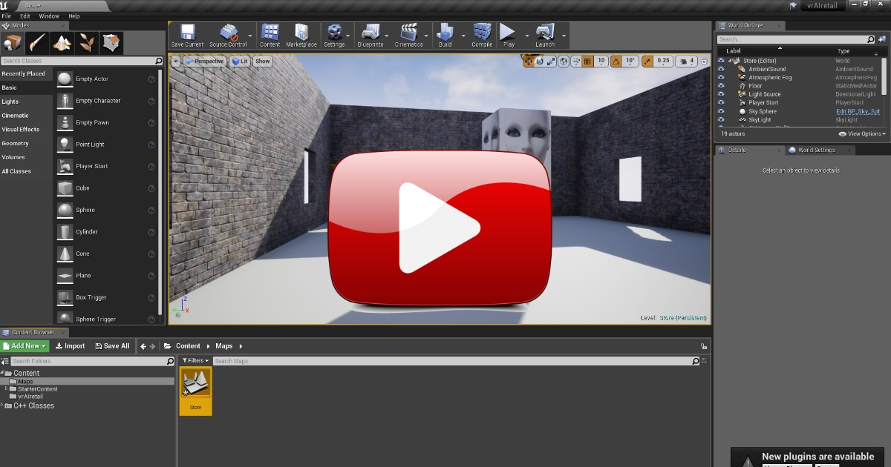](https://www.youtube.com/watch?v=OJOHfRUCgg4)

# Contributing
Please read **CONTRIBUTING.md** for details on our code of conduct, and the process for submitting pull requests to us.

# Versioning
We use SemVer for versioning. For the versions available, see the tags on this repository.

# License
This project is licensed under the **MIT License** - see the **LICENSE.md** file for details

## Bugs/Issues

Please feel free to create issues for bugs and general issues you come across whilst using this or any other Oculus related iotJumpWay issues. You may also use the issues area to ask for general help whilst using the iotJumpWay projects.

## Contributors

[](https://www.adammiltonbarker.com)