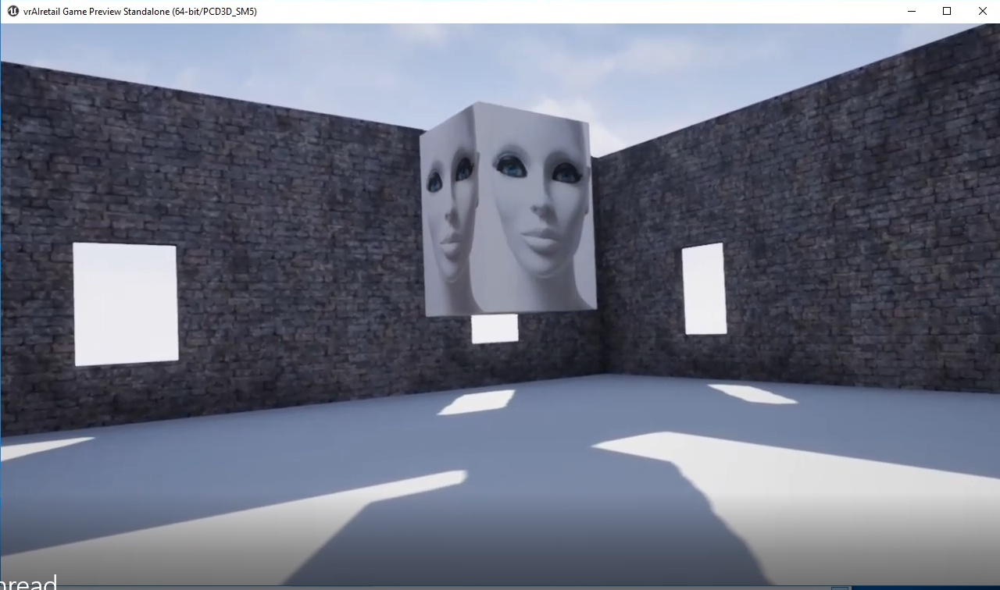

# vrAIretail for Oculus Rift

vrAIretail takes you from a blank Unreal Engine 4 Oculus project to a functioning Artificially Intelligent VR store assistant. To include voice synthesis, natural language understanding and the Internet of Things.

## Software Requirements

- [Unreal Engine](https://www.unrealengine.com/en-US/what-is-unreal-engine-4 "Unreal Engine") in this example 4.19.2 was used.
- [Visual Studio 2015](https://visualstudio.microsoft.com/vs/older-downloads "Visual Studio 2015").

## Hardware Requirements

- 1 x VR ready machine
- 1 x [Oculus Rift](https://software.intel.com/en-us/ai-academy/tools/devcloud "Oculus Rift")

## Install Required Software

Set up Unreal Engine and Visual Studio 2015, you need to that specific version of Visual Studio. Whilst installing Visual Studio 2015 you need to ensure that you install the C++ extras also.

## Cloning The Repo

You will need to clone this repository to a location on your development terminal. Navigate to the directory you would like to download it to and issue the following commands.

    $ git clone https://github.com/iotJumpway/Oculus-Examples.git

Once you have the repo, you will need to find the files in this folder located in [Oculus-Examples/Rift/vrAIretail](https://github.com/iotJumpway/Oculus-Examples/tree/master/Rift/vrAIretail "Oculus-Examples/Rift/vrAIretail").

## Bugs/Issues

Please feel free to create issues for bugs and general issues you come across whilst using this or any other Oculus related iotJumpWay issues. You may also use the issues area to ask for general help whilst using the iotJumpWay projects.

## Contributors

